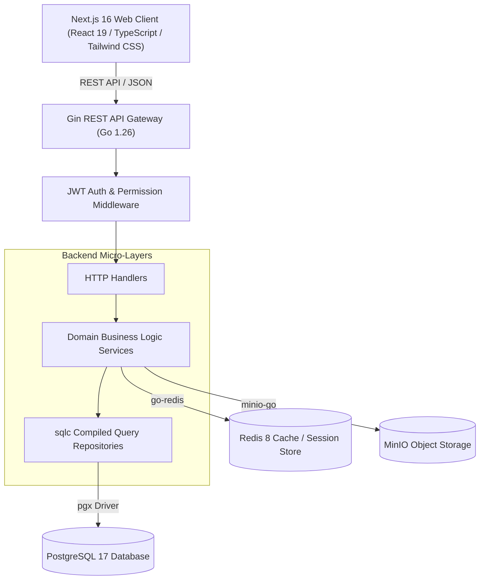

# AUMS — AI Powered Autonomous Management System


**AUMS (AI Powered Autonomous Management System)** is an open-source, enterprise-grade University ERP and Academic Autonomous Management System. Built with a ultra-performant Go backend (Gin, pgx, sqlc) and a modern Next.js 16 frontend (React 19, TypeScript, Tailwind CSS v4), AUMS manages the complete higher-education academic lifecycle — including institutions, campuses, schools, departments, degree programs, student enrollments, course offerings, examination schedules, grading, transcript generation, granular Role-Based Access Control (RBAC), and AI-assisted governance.

---

## Project Goals

- **Comprehensive Academic Lifecycle**: Provide a single unified system for managing multi-campus university operations from admission to graduation.
- **High Performance & Reliability**: Leverage Go, compiled SQL via `sqlc`, and Redis caching to handle concurrent student and faculty operations with minimal latency.
- **Granular Security & Compliance**: Enforce strict Role-Based Access Control (RBAC) with fine-grained permissions across Super Admins, Deans, HODs, Faculty, Students, and Parents.
- **Modern User Experience**: Deliver a fast, accessible, responsive web application with dark/light themes, dynamic data tables, and interactive analytics dashboards.
- **Modular Enterprise Architecture**: Provide clear separation of concerns across backend handlers, domain services, database queries, object storage, and frontend capsules.

---

## Key Capabilities

- **Institutional Hierarchy**: Manage Campuses, Schools, Departments, Degree Programs, and Academic Batches.
- **Course & Curriculum Management**: Define Course Catalog items, Credit Structures, Prerequisites, Program Curriculums, and Term Course Offerings.
- **Faculty Allocations & Timetables**: Assign faculty to course sections, manage classroom facilities, and build automated timetables.
- **Student Registrations & Progress**: Track student profiles, term enrollments, course registrations, and attendance metrics.
- **Examinations & Grading System**: Configure exam schedules, seating rooms, marks entries, SGPA/CGPA calculations, backlog tracking, and semester/program results publication.
- **Official Transcripts**: Generate cumulative academic performance summaries and verifiable student transcripts.
- **Role-Based Access Control (RBAC)**: Manage dynamic Roles, System Permissions, and User Role Allocations with instant route guards.
- **Object Storage Integration**: MinIO integration for managing syllabus documents, student avatars, and assignment attachments.
- **AI & Retrieval-Augmented Generation (RAG)**: Built-in architecture hooks for automated academic query assistance and institutional rule retrieval.

---

## Architecture Overview

AUMS follows a strict clean layer architecture: **Repository → Service → Handler** on the backend and **Feature-First Capsules** on the frontend.



---

## Tech Stack

### Frontend
- **Framework**: Next.js 16 (App Router), React 19
- **Language**: TypeScript 5
- **Styling**: Tailwind CSS v4, `clsx`, `tailwind-merge`
- **State Management**: Zustand
- **Form Validation**: React Hook Form, Zod, `@hookform/resolvers`
- **Data Display**: TanStack Table v8, Recharts, Lucide React
- **Notifications & UI**: Sonner, Framer Motion, Next-Themes

### Backend
- **Language**: Go 1.26
- **Web Framework**: Gin Web Framework
- **Database Access**: `sqlc` (Type-safe SQL compilation), `pgx/v5`
- **Authentication**: JWT (`golang-jwt/v5`), `golang.org/x/crypto/bcrypt`
- **Configuration**: Viper (`spf13/viper`)
- **Logging**: Zap (`go.uber.org/zap`)
- **API Documentation**: Swaggo (`swag`, `gin-swagger`)

### Infrastructure & Database
- **Database**: PostgreSQL 17
- **Caching & Rate Limiting**: Redis 8
- **Object Storage**: MinIO
- **Containerization**: Docker & Docker Compose

---

## Repository Structure

```text
AUMS/
├── architecture/          # System architecture diagrams (.drawio)
├── backend/               # Go REST API backend service
│   ├── cmd/server/        # Application entrypoint (main.go)
│   ├── configs/           # Configuration files (development.yaml)
│   ├── internal/          # Domain modules (auth, users, courses, results, etc.)
│   ├── pkg/               # Reusable packages (database, logger, middleware, validator)
│   └── sqlc.yaml          # sqlc compiler configuration
├── database/              # PostgreSQL schema, migrations, and seeds
│   ├── migrations/        # SQL migration files (001_initial_schema.sql)
│   ├── queries/           # sqlc query definitions (.sql)
│   └── seeds/             # Development seeding SQL scripts (001-014)
├── docker-compose.yml     # Local infrastructure services (Postgres, Redis, MinIO)
├── docs/                  # Technical documentation & architecture guides
├── frontend/              # Next.js 16 frontend application
│   ├── app/               # Next.js App Router pages and layouts
│   ├── components/        # Global shared UI components
│   ├── features/          # Domain-specific feature capsules (auth, students, etc.)
│   ├── services/          # API Axios clients & endpoints
│   └── types/             # Shared TypeScript declarations
├── scripts/               # Utility scripts (seed-dev.sh, reset-db.sh, setup.sh)
├── LICENSE                # Apache License 2.0
├── README.md              # Project README
├── SECURITY.md            # Security vulnerability policy
├── CONTRIBUTING.md        # Community contribution guide
└── CODE_OF_CONDUCT.md     # Code of conduct
```

---

## Prerequisites

Before running AUMS locally, ensure you have the following installed:

- **Go**: `v1.26` or higher
- **Node.js**: `v20.x` or `v22.x` (npm `v10.x`+)
- **Docker & Docker Compose**: Docker Desktop or Docker Engine
- **PostgreSQL Client** (`psql`): Optional (used by seed scripts if present)

---

## Local Development Setup

### 1. Clone the Repository
```bash
git clone https://github.com/notharsh0905/AUMS.git
cd AUMS
```

### 2. Start Infrastructure Services (Docker)
Start PostgreSQL, Redis, and MinIO containers:
```bash
docker compose up -d
```
Verify that all containers are healthy:
```bash
docker compose ps
```

### 3. Initialize & Seed Database
Execute database migrations and seed development accounts:
```bash
# Make scripts executable
chmod +x scripts/*.sh

# Run database seed script
./scripts/seed-dev.sh
```

### 4. Run the Backend Service
```bash
cd backend
go run cmd/server/main.go
```
The backend API server will start on `http://localhost:8080`.
Swagger API documentation will be available at `http://localhost:8080/swagger/index.html`.

### 5. Run the Frontend Application
In a new terminal window:
```bash
cd frontend
npm install
npm run dev
```
The frontend application will open on `http://localhost:3000`.

---

## Environment Variables

Copy the safe `.env.example` templates to configure your local setup:

### Backend Configuration (`backend/configs/development.yaml` or `.env`):
```env
APP_ENV=development
SERVER_PORT=8080
DB_HOST=localhost
DB_PORT=5432
DB_USER=postgres
DB_PASSWORD=postgres
DB_NAME=aums_dev
JWT_SECRET=aums-super-secret-key-change-in-production
MINIO_ENDPOINT=localhost:9000
MINIO_ACCESS_KEY=minioadmin
MINIO_SECRET_KEY=minioadmin
```

### Frontend Configuration (`frontend/.env.local`):
```env
NEXT_PUBLIC_APP_ENV=development
NEXT_PUBLIC_API_URL=http://localhost:8080/api/v1
```

---

## Demo Accounts

> [!WARNING]
> **LOCAL DEVELOPMENT ONLY**: The credentials below are provided strictly for local development, demonstration, and evaluation purposes. **Never deploy demo credentials or default secrets to production environments.**

| Role | Email | Password | Scope & Access Level |
| :--- | :--- | :--- | :--- |
| **Super Admin** | `admin@aums.com` | `Admin@123` | Full System Control, RBAC Management |
| **Institution Admin** | `institution.admin@aums.edu` | `Admin@123` | Institutional Setup, Schools, Departments |
| **Dean** | `dean.engineering@aums.edu` | `Admin@123` | Faculty Allocations, Curriculum Approval |
| **HOD (CSE)** | `hod.cse@aums.edu` | `Admin@123` | Department Courses, Class Sessions |
| **Faculty Member** | `faculty.cse1@aums.edu` | `Admin@123` | Class Attendance, Marks Entry, Grading |
| **Student** | `student1@aums.edu` | `Admin@123` | Registrations, Transcripts, Results View |
| **Parent** | `parent1@aums.edu` | `Admin@123` | Student Academic Progress View |

---

## Testing & Quality Assurance

### Backend Tests & Verification
Run Go formatting, static code analysis, unit tests, and compilation check:
```bash
cd backend
go fmt ./...
go vet ./...
go test ./...
go build ./...
```

### Frontend Linting & Build Verification
Run ESLint checks and generate static production bundles:
```bash
cd frontend
npm run lint
npm run build
```

---

## Current Status & Roadmap

### Current Status: **AUMS V1.0.1 — Frozen Baseline**
- **Release Tag**: `aums-v1.0.1`
- Core university ERP modules (Students, Faculty, Courses, Examinations, Grading, Transcripts, RBAC) are fully implemented and verified.
- The V1 codebase is frozen to serve as a reliable, stable reference point.

### Roadmap (Future V2 Scope)
- [ ] AI-Powered Automated Timetable Generation
- [ ] Retrieval-Augmented Generation (RAG) assistant for university regulations & handbook search
- [ ] Student Attendance Biometric/RFID Hardware Integration
- [ ] Multi-Tenant SaaS Architecture for hosting multiple independent universities
- [ ] Real-time WebSocket Notifications for exam results and announcements

---

## Security

Security vulnerabilities should be reported responsibly following the guidelines outlined in [`SECURITY.md`](SECURITY.md). Please do not disclose vulnerabilities publicly via GitHub issues.

---

## Contributing

We welcome community contributions! Please review our [`CONTRIBUTING.md`](CONTRIBUTING.md) guide and adhere to our [`CODE_OF_CONDUCT.md`](CODE_OF_CONDUCT.md).

---

## License

AUMS is open-source software licensed under the [Apache License 2.0](LICENSE). Copyright © 2026 AUMS Project.
