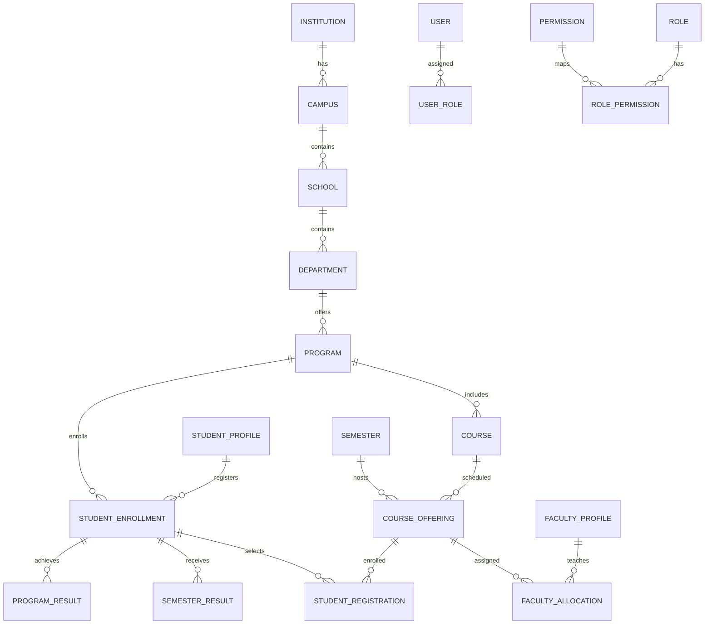

# AUMS Database Architecture & Migration Guide

**Database System**: PostgreSQL 17
**Code Generation**: `sqlc` (`database/queries/*.sql` → `backend/internal/db/generated`)

---

## 1. Schema Migration Pipeline

Database schema changes in AUMS are managed via sequential SQL migration scripts located in `database/migrations/`:

```text
database/migrations/
├── 001_initial_schema.sql                       # Core users, institutions, campuses, roles
├── 002_create_schools_and_departments.sql       # Academic organization hierarchy
├── 003_create_programs_and_courses.sql          # Degree programs & course catalog
├── 004_create_academic_years_and_semesters.sql  # Calendar terms and academic years
├── 005_create_course_offerings.sql              # Term-specific course section offerings
├── 006_create_student_enrollments.sql           # Student program enrollments
├── 007_create_student_course_registrations.sql  # Student course registrations
├── 008_create_faculty_course_allocations.sql    # Faculty teaching assignments
├── 009_create_class_sessions_and_attendance.sql # Class sessions & student attendance
├── 010_create_assignments_and_submissions.sql # Coursework assignments & submissions
├── 011_create_examinations_and_schedules.sql    # Exams, rooms, seating allocations
├── 012_create_exam_registrations_and_attempts.sql # Student exam attempts & marks
├── 013_create_results_and_transcripts.sql       # Course results, SGPA/CGPA, transcripts
└── 014_create_rbac_and_audit_logs.sql           # Audit logging and permission maps
```

---

## 2. Core Entities & Relationships



---

## 3. Seed System

Development seed scripts are located in `database/seeds/` and executed in order by `scripts/seed-dev.sh`:

1. `001_cleanup.sql` — Truncates existing tables in proper foreign-key cascade order.
2. `002_roles_and_permissions.sql` — Seeds 7 default system roles and permissions.
3. `003_academic_structure.sql` — Seeds sample campus, school, and department entries.
4. `004_programs_and_courses.sql` — Seeds B.Tech Computer Science degree program and courses.
5. `005_academic_terms.sql` — Seeds Academic Years (2024-2028) and Semesters.
6. `006_facilities_and_rooms.sql` — Seeds classroom halls and examination rooms.
7. `007_grading_schemes.sql` — Seeds grade letter point maps (A+=10, A=9, B=8, etc.).
8. `008_users.sql` — Seeds user accounts (`admin@aums.com`, `faculty.cse1@aums.edu`, etc.).
9. `009_user_roles.sql` — Binds users to their respective roles.
10. `010_demo_institution.sql` — Configures demo institution attributes.
11. `011_course_offerings.sql` — Schedules term course offerings.
12. `012_student_enrollments.sql` — Registers demo students.
13. `013_faculty_allocations.sql` — Assigns demo faculty to course sections.
14. `014_demo_profiles.sql` — Creates student, faculty, and parent profiles with demo records.

---

## 4. `sqlc` Type-Safe SQL Compiler

AUMS uses `sqlc` to compile raw SQL query files (`database/queries/*.sql`) directly into type-safe Go code in `backend/internal/db/generated/`:

- `queries.sql.go`: Type-safe function signatures (`CreateUser`, `GetUserByEmail`, `ListStudents`, etc.).
- `models.go`: Go struct definitions representing database table schemas.
- `db.go`: DBTX interface wrapper supporting single connections and database transactions.
